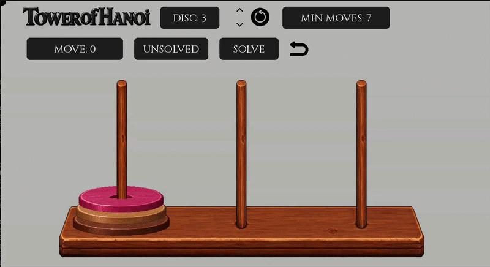
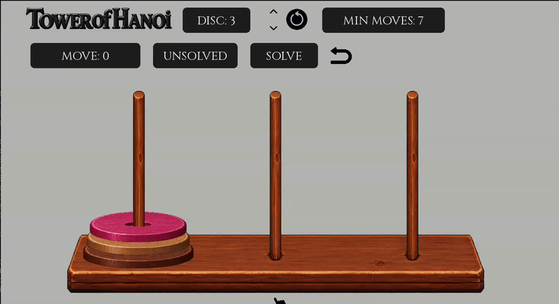
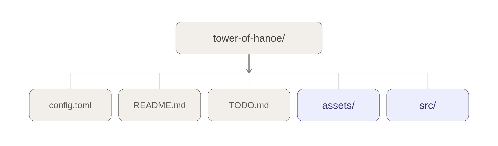
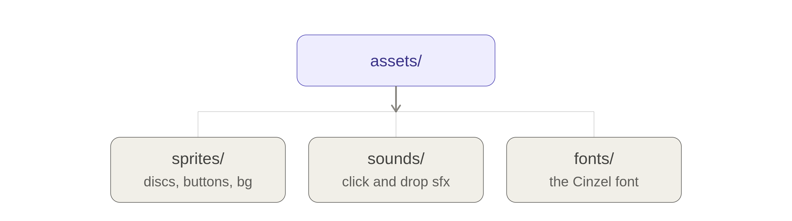
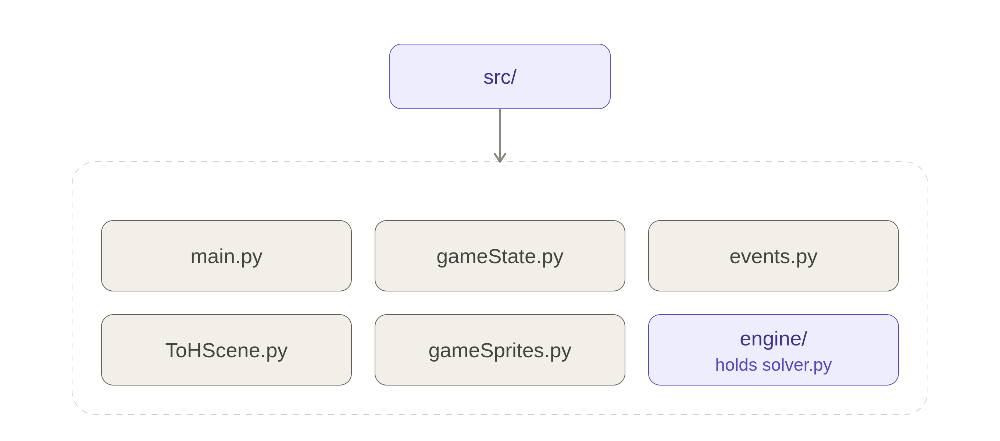

# Tower of Hanoi

A Tower of Hanoi puzzle game made with Python and pygame-ce and with a bot implemented to solve it. BFS algorithm is used for the bot.

Move the discs yourself by dragging them with the mouse. Or press **SOLVE** and watch the bot move them in the fewest possible number of moves.

**DEMO**<br>
*AUTO SOLVING MODE*

<br>
<br>
*MANUAL SOLVING MODE*


## HOW TO PLAY

- Drag discs from one peg to another, one disc at a time.
- You can only pick up the disc on top of a peg.
- You can only put a smaller disc on top of a bigger one. U can alawys put the disc in a peg.
- The goal is to move the whole stack from peg **A** to peg **C**.
- Press **SOLVE** (during the **UNSOLVED** state) and the bot does it for you, using the smallest possible number of moves.
- Add or remove discs, from 3 up to 10.
- Take back a move you did not like with the undo button.
- Make the bot faster or slower while it is playing.
- Click *Restart* to restart from the initial state

## SETUP AND RUNNING

### Dependencies

- Python 3.12 or newer
- `pygame-ce`

Create a virtual environment.
```bash 
python3 -m venv .venv # if u have python3
python -m venv .venv # if u have python
```
Activate venv
```bash
source .venv/bin/activate # for linux 
.\env_name\Scripts\Activate.ps1 # for windows
```
Install the library:

```bash
pip install pygame-ce
```

### Run it

Go into the `src` folder, then start the game:

```bash
cd src
python3 main.py # if u have python3
python main.py # if u have python
```

## Controls

| What you want to do | How to do it |
| --- | --- |
| Move a disc | Press and hold on the top disc of a peg, drag it, then let go over the peg you want |
| Let the bot solve it | Press the **SOLVE** button |
| Add one more disc | Press the **up arrow** button |
| Remove one disc | Press the **down arrow** button |
| Start the game over | Press the **restart** button |
| Undo your last move | Press the **undo** button. This only works after you have made at least one move |
| Make the bot faster | Press the **up arrow** button on the left side of the screen. It only shows up while the bot is playing |
| Make the bot slower | Press the **down arrow** button on the left side of the screen |

You can only change the number of discs, press **SOLVE**, or undo when the game is not already in progress.

## PROJECT STRUCTURE



